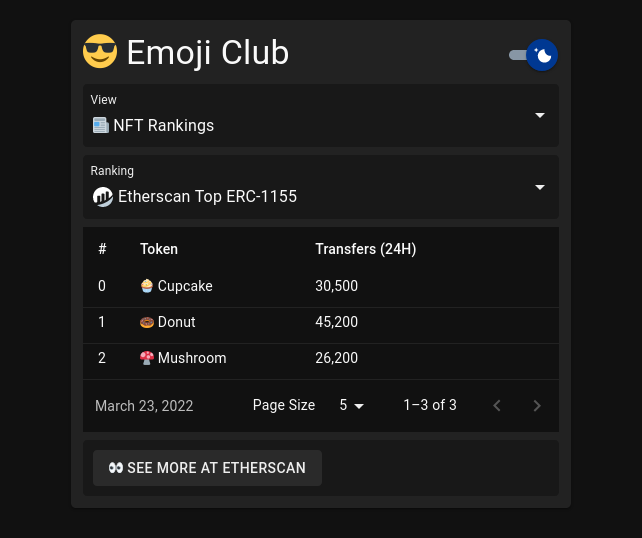

# 😎 Emoji Club

> ⚠️  **WIP:** This project is work in progress

`#ethereum` `#nft` `#react`

Full Stack Emoji NFT Dapp

- **Backend by**: [Next.js][next], [Apollo Server][apollo-server], [LXML][lxml]
- **Frontend by**: [Apollo][apollo], [Ethers][ethers], [MUI][mui], [React][react], [RxJS][rxjs]
- **NFTs by**: [Ethereum][ethereum], [Hardhat][hardhat], [OpenZeppelin][openzeppelin]

---

<table>
  <tr>
    <td>
      
    </td>
    <td>
      
    </td>
  </tr>
  <tr>
    <td>
      
    </td>
    <td>
      
    </td>
  </tr>
</table>

[apollo]: https://github.com/apollographql/apollo-client
[apollo-server]: https://github.com/apollographql/apollo-server
[ethereum]: https://github.com/ethereum
[ethers]: https://github.com/ethers-io/ethers.js/
[hardhat]: https://github.com/NomicFoundation/hardhat
[lxml]: https://github.com/lxml/lxml
[mui]: https://github.com/mui
[next]: https://github.com/vercel/next.js
[openzeppelin]: https://github.com/OpenZeppelin/openzeppelin-contracts
[react]: https://github.com/facebook/react
[rxjs]: https://github.com/ReactiveX/rxjs
