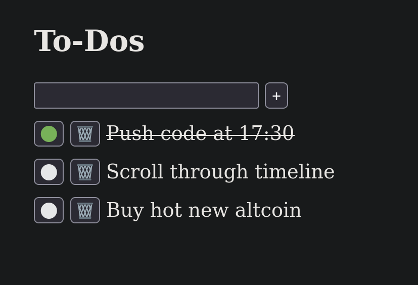

# 📝 Reactive To-Dos

MVC React architecture with injected state observables, and isolated controller classes

[][live_demo]

---

  

[live_demo]: https://codesandbox.io/s/github/hd-o/coding-challenge/tree/main/packages/reactive-todos
