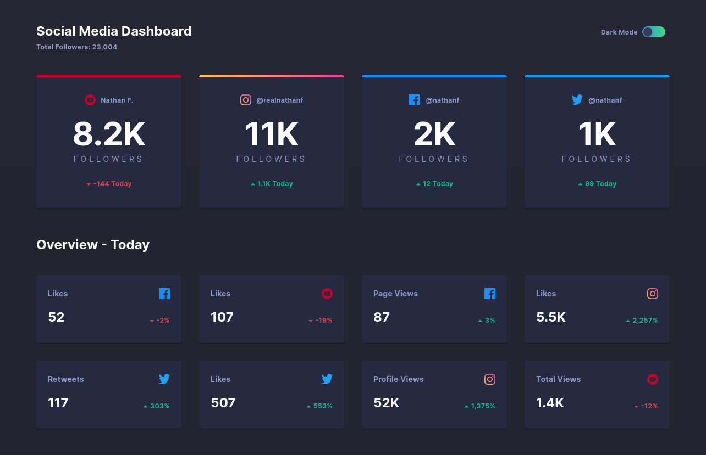

# 👁️‍🗨️ Social Media Dashboard

`#dashboard` `#react` `#ui`

[][demo]
[][codeanywhere-demo]

[codeanywhere-demo]: https://app.codeanywhere.com/#https://github.com/hd-o/coding-challenge/blob/918c9a0a63586e4b17fd5c65188962d3115e8a2e/packages/social-dashboard/README.md

[demo]: https://stackblitz.com/github/hd-o/coding-challenge?configPath=packages/social-dashboard&file=packages/social-dashboard/index.html&startScript=run:social-dashboard

Responsive, drag & drop enabled dashboard

---

