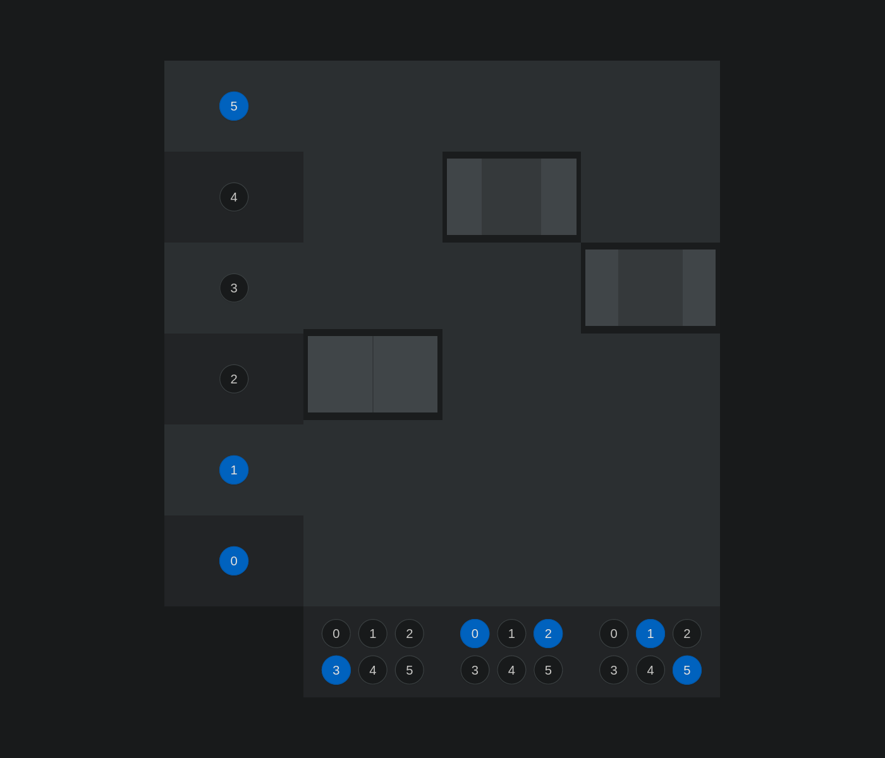

# 🛗 Virtual Elevators

`#elevators` `#react` `#solid`

[][demo]

Virtual elevators, powered by controller classes, and React components.

This project is a follow-up to [solid-calendar][solid_calendar], and [reactive-todos][reactive_todos], with the goal of achieving a SOLID architecture with React, while isolating logic functions from view components, being able to run these functions with other view frameworks, or even with physical devices. This project is a sibling to [rx-elevators][rx_elevators], which aims at the same goals while using function composition, without classes.

[MobX][mobx] was my preferred option for managing state in front-end applications, but for this project I decided to experiment with [RxJS][rxjs] for data observability, a decision I greatly appreciate. I later deep-dived into Rx while developing [rx-elevators][rx_elevators]

---

<table>
  <tr>
    <td>
      
    </td>
    <td>
      
    </td>
  </tr>
</table>

[demo]: https://stackblitz.com/github/hd-o/coding-challenge?configPath=packages/virtual-elevators&file=packages/virtual-elevators/index.html&startScript=run:ve

[mobx]: https://github.com/mobxjs/mobx

[reactive_todos]: ../reactive-todos/

[rx_elevators]: ../rx-elevators/

[rxjs]: https://github.com/ReactiveX/rxjs

[solid_calendar]: ../solid-calendar/
