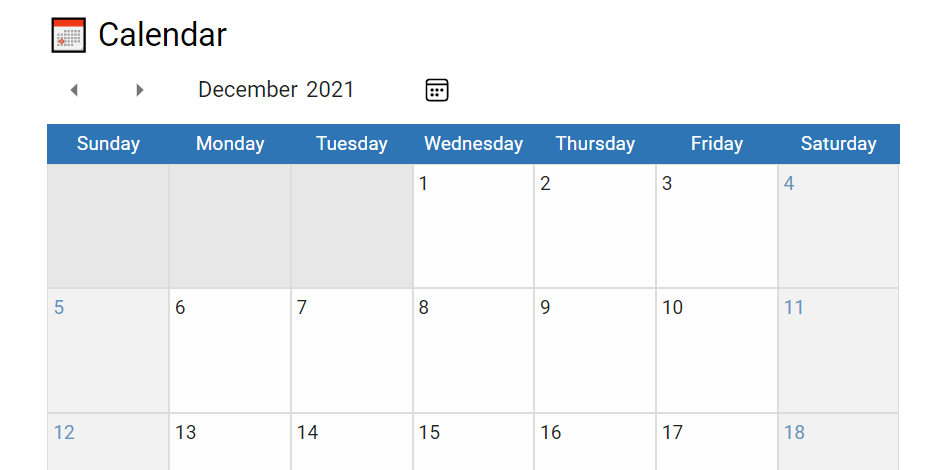
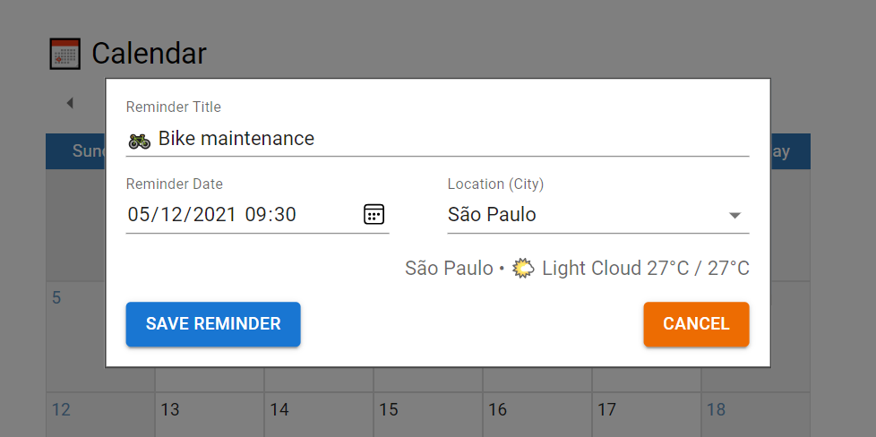
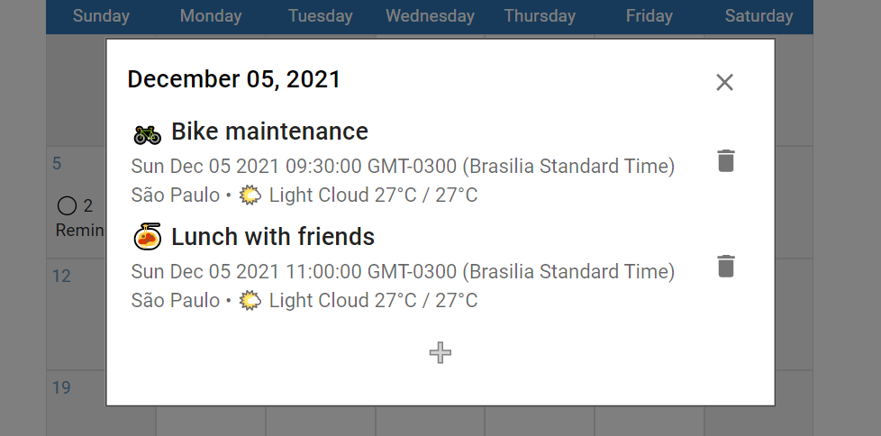

# SOLID Calendar

Research on coding a [SOLID][solid] and [functional][functional] front-end architecture with [React][react]

[🖥️ Live Demo @ CodeSandbox][live_demo]

## Project Goals

- Front-end focused
  - Focus on developing a front-end architecture
  - No need for a back-end database, or logic API
  - Do not use libraries like FullCalendar
- Calendar features:
  - Ability to select other calendar months
  - Ability to add reminders for a given day
  - Reminders with title, city, date, and time
  - Ability to edit each reminder
  - Get weather forecast, if available, for each reminder
    - Forecast should be of the reminder date
    - Use a service like MetaWeather, AccuWeather, e.t.c
  - Automated tests to cover these functionalities
- Architecture features:
  - Inversion of control on all dependencies
    - Dependencies can be injected/swaped at runtime
  - Functional components, and state definition
    - Lazy-loadable modules
    - Isolated, and reusable functionality

## Screenshots

[solid]: https://en.wikipedia.org/wiki/SOLID

[functional]: https://en.wikipedia.org/wiki/Functional_programming

[react]: https://reactjs.org/

[live_demo]: https://jtohp.sse.codesandbox.io/
